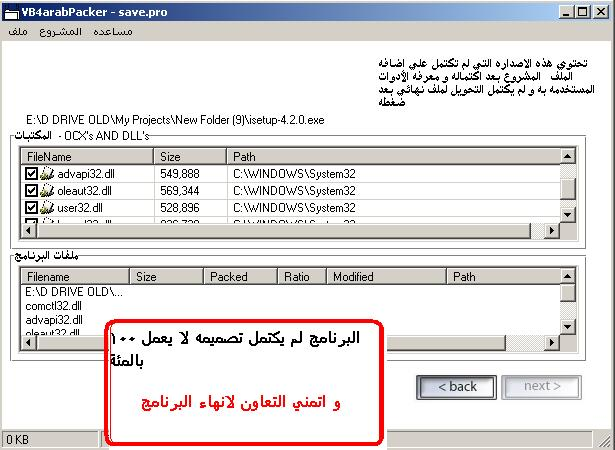



## Visual Basic Packager 0\.5 \[Arabic Edition\]

### Description

this for make one exe file for the program and working without ocx cuz it's see all dependece files and put in on the final exe file complied ..

As like VB PowerWrap / Alloy / and other like programs but this one is open source idea

version 0.5 have some good ideas that's working but dosn't compile the file to exe .

grab the exe file , and check for all ocx and dll needed to run and also can add the files that's needed ..

but it's not compile exe for the final exe with the ocx's .

i wish some one work with me .

this is arabic version of the code.
 
### More Info
 

             |
---                |---
**Submitted On**   |2004-03-26 23:25:38
**By**             |[Sharif aly Fouad](https://github.com/Planet-Source-Code/PSCIndex/blob/master/ByAuthor/sharif-aly-fouad.md)
**Level**          |Advanced
**User Rating**    |5.0 (20 globes from 4 users)
**Compatibility**  |VB 6\.0
**Category**       |[Coding Standards](https://github.com/Planet-Source-Code/PSCIndex/blob/master/ByCategory/coding-standards__1-43.md)
**World**          |[Visual Basic](https://github.com/Planet-Source-Code/PSCIndex/blob/master/ByWorld/visual-basic.md)
**Archive File**   |[Visual\_Bas1887065112005\.zip](https://github.com/Planet-Source-Code/sharif-aly-fouad-visual-basic-packager-0-5-arabic-edition__1-60482/archive/master.zip)

